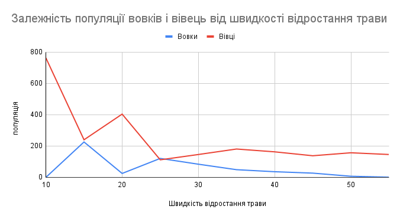
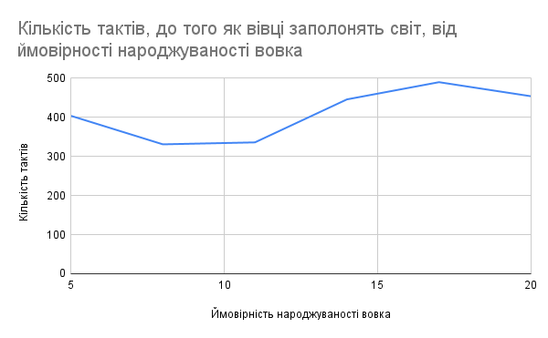

## Комп'ютерні системи імітаційного моделювання
## СПм-22-11, **Іванов Іван Іванович**
### Лабораторна робота №**1**. Опис імітаційних моделей та проведення обчислювальних експериментів

 

### Варіант 7, модель у середовищі NetLogo:
[Wolf Sheep Predation](http://www.netlogoweb.org/launch#http://www.netlogoweb.org/assets/modelslib/Sample%20Models/Biology/Wolf%20Sheep%20Predation.nlogo)

 

### Вербальний опис моделі:
Симуляція вовка та вівці — це тип сценарію моделювання на основі агентів, який імітує взаємодію між двома типами об’єктів: вовками та вівцями. Цей тип моделювання часто використовується для вивчення динаміки хижак-жертва та екологічних систем. Симуляція зазвичай передбачає правила та поведінку як для вовків, так і для овець, що дозволяє дослідникам або розробникам спостерігати за тим, як популяції кожного виду змінюються з часом.

### Керуючі параметри:
- **initial-number-of-sheeps** визначає кількість початкову овець у середовищі моделювання.
- **initial-number-of-wolves** визначає кількість початкову вовків у середовищі моделювання.
- **grass-regrowth-time** час зростання трави у середовищі моделювання.
- **sheep-gain-from-food** визначає кількість енергії, що отримує вівця від пожинання трави.
- **wolf-gain-from-food** визначає кількість енергії, що отримує вовк від пожинання вівці.
- **sheep-reproduce** визначає ймовірність розмноження вівці на кожному кроку моделювання.
- **wolf-reproduce** визначає ймовірність розмноження вовка на кожному кроку моделювання.

### Внутрішні параметри:
- **wolf-energy**. Енергія вовка у поточний модель часу.
- **sheep-energy**. Енергія вівці у поточний модель часу.
- **max-sheep**. Обмеження максимальної кількості вівець. Це загальний параметр для всіх вівець.
- **countdown**. countdown: Використовується для відліку часу до повторного виростання трави (якщо використовується версія моделі "sheep-wolves-grass").

### Показники роботи системи:
- кількість популяції вовків у поточний момент.
- кількість популяції вівець у поточний момент (не може перевищувати max-sheep) .
- кількість трави у наявності у поточний момент.

### Недоліки моделі:
- У поточній моделі взаємодія між вовками і овцями обмежена. Наприклад, немає більш складних стратегій полювання або уникнення. Модель може бути поліпшена шляхом додавання більш складних правил взаємодії.
- У моделі розмноження відбувається за певним ймовірнісним законом, але це не обов'язково відображає реальні закономірності розмноження вовків та овець у природі. Модель може виграти на реалістичності, використовуючи більш складні та реалістичні правила для розмноження.
 

## Обчислювальні експерименти
### 1. Вплив швидкості відростання трави на популяцію вовків та овець
Досліджується залежність розміру популяції вовків та овець протягом певної від швидкості відростання трави. Заміри відбуваються після того, як у моделі пройшло 500 тактів.
Усього було проведено 10 ексеперементів
Інші керуючі параметри мають значення за замовчуванням:
- **initial-number-of-sheeps** 100.
- **initial-number-of-wolves** 50.
- **sheep-gain-from-food** 4.
- **wolf-gain-from-food** 20.
- **sheep-reproduce** 4.
- **wolf-reproduce** 4.

<table>
<thead>
<tr><th>Кількість вівець</th><th>Кількість вовків</th><th>Швидкість відростання трави</th></tr>
</thead>
<tbody>
<tr><td>763</td><td>0 </td><td>10</td></tr>
<tr><td>240</td><td>226</td><td>15</td></tr>
<tr><td>404</td><td>25</td><td>20</td></tr>
<tr><td>112</td><td>121</td><td>25</td></tr>
<tr><td>146</td><td>84</td><td>30</td></tr>
<tr><td>181</td><td>49</td><td>35</td></tr>
<tr><td>163</td><td>36</td><td>40</td></tr>
<tr><td>138</td><td>27 </td><td>45</td></tr>
<tr><td>157</td><td>7 </td><td>50</td></tr>
<tr><td>146</td><td>1 </td><td>55</td></tr>

</tbody></td>
</table>

Графік наочно показує, що кількість вовків починає стрімко зменшуватися, якщо на відростання трави необхідно 25 тактів і більше, в той час як за наявності вовків популяція вівець залишається приблизно тією самою.

### 2. Час, який необхідний вівцям, щоб досягти максимальної популяції

Якщо прибрати траву з моделі, то вівці можуть досягти **max-sheep** і заполонити світ.
Дослідимо, як швидко це відбудеться при змінах **wolf-gain-from-food**. 
Усього було проведено 11 ексеперементів.
Інші керуючі параметри мають значення за замовчуванням:
- **initial-number-of-sheeps** 100.
- **initial-number-of-wolves** 50.
- **sheep-gain-from-food** 4.
- **sheep-reproduce** 4.
- **wolf-reproduce** 4.

<table>
<thead>
<tr><th>Кількість тактів</th><th>Енергія, що отримує вовк від їжі</th></tr>
</thead>
<tbody>
<tr><td>412</td><td>20</td></tr>
<tr><td>366</td><td>25</td></tr>
<tr><td>404</td><td>30</td></tr>
<tr><td>357</td><td>35</td></tr>
<tr><td>362</td><td>40</td></tr>
<tr><td>374</td><td>45</td></tr>
<tr><td>370</td><td>50</td></tr>
<tr><td>223</td><td>65</td></tr>
<tr><td>403</td><td>70</td></tr>

</tbody></td>
</table>

Графік не був побудований, адже по таблиці та дослідам залежності не було виявлено. Коли вовки отримували 55 та 60 одиниць енергії, вони з'їли усіх вівець за 346 та
230 тактів відповідно. Це відбулося через те, що хоча вовки й можуть жити довше, бо зростає кількость енергії, що вони отримують від вівець, настає час, коли вівець мало, вовки починають вимирати, а ймовірність розмноження вовка не така вже й велика. Це призводить до того, що вовки вимирають, а вівці заполоняють світ. 
За дослідами, частіше вівці заполоняли світ, але іноді вовки усіх з'їдали.

### 3. Чи зміниться ситуація з досліду два, якщо підвищувати народжуваність вовків?

Проведемо дослід 2, але будемо відстежувати залежність від народжуваності вовків. 
Було проведено 6 дослідів.
Інші керуючі параметри мають значення за замовчуванням:
- **initial-number-of-sheeps** 100.
- **initial-number-of-wolves** 50.
- **sheep-gain-from-food** 4.
- **wolf-gain-from-food** 20.
- **sheep-reproduce** 4.

<table>
<thead>
<tr><th>Кількість тактів</th><th>Ймовість народжуваності вовка</th><th>Заполонили вівці світ?</th></tr>
</thead>
<tbody>
<tr><td>404</td><td>5</td><td>так</td></tr>
<tr><td>331</td><td>8</td><td>так</td></tr>
<tr><td>336</td><td>11</td><td>так</td></tr>
<tr><td>446</td><td>14</td><td>так</td></tr>
<tr><td>490</td><td>17</td><td>так</td></tr>
<tr><td>454</td><td>20</td><td>так</td></tr>
</tbody></td>
</table>

При таких керуючих параметрах вівці завжди заполонять світ. Можна помітити, що кількість тактів до цього зростає через те, що вовки живуть довше і довше вигризають вівець, через це тривалий час багато вовків, і вівцям необхідно більше часу, щоб вовки вимерли і вони заполонили світ.